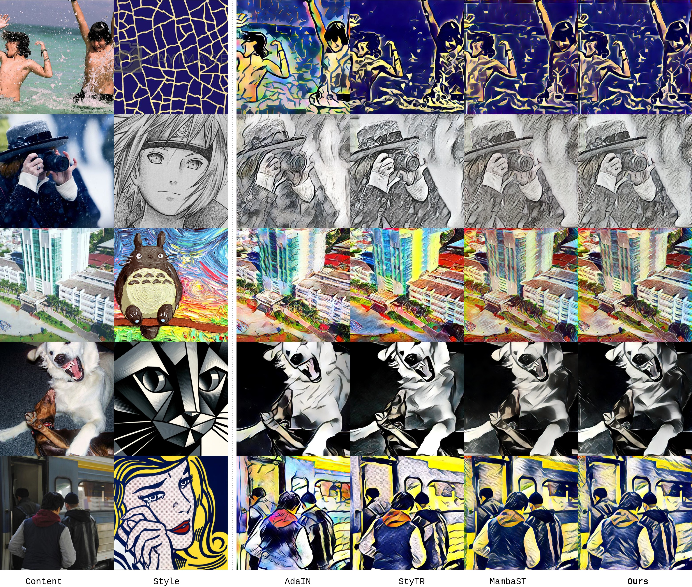
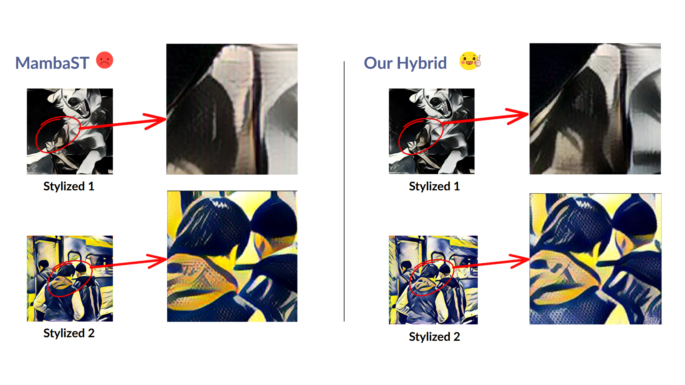
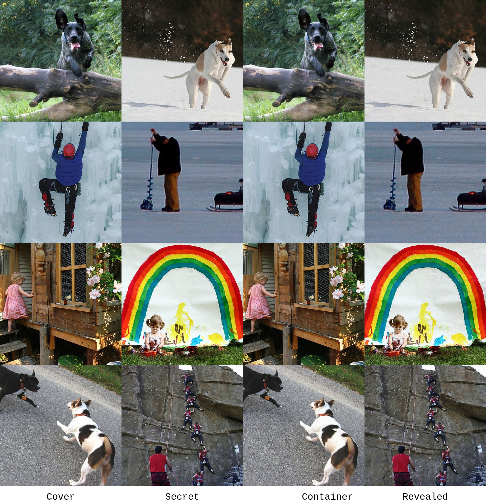

# MambaStegaFormer: A Novel Framework for Serial Style Transfer with Content Preservation

## Introduction

In the evolving domain of computer vision and image processing, style transfer has become a widely adopted technique for reimagining images in various artistic styles. Traditional style transfer approaches, however, are constrained to applying a single style per transformation, often resulting in the degradation of an image's semantic content when multiple styles are applied sequentially. To overcome this limitation, we present **MambaStegaFormer**, an advanced deep learning framework engineered for **serial style transfer**, enabling the sequential application of multiple artistic styles while ensuring the preservation of the original image's core semantic content.

The MambaStegaFormer framework leverages a sophisticated design that integrates two key components:

- **Hybrid Mamba-Transformer Backbone**: This innovative architecture merges the efficiency of Mamba models with the robust representational capacity of transformer networks. By combining these strengths, the backbone delivers powerful and efficient feature modeling, enabling the framework to maintain content fidelity throughout repeated stylizations.
- **Steganographic Pipeline**: Comprising a U-Net-based Hider and a CNN-based Revealer, this pipeline embeds original content information into the stylized images and subsequently retrieves it. This mechanism ensures that the semantic integrity of the image is preserved, even after multiple style applications.

### Key Features

- **Serial Style Transfer**: Supports the sequential application of multiple artistic styles, offering greater flexibility in creative image manipulation.
- **Enhanced Feature Modeling**: Utilizes a hybrid Mamba-Transformer backbone for superior efficiency and accuracy in processing image features.
- **Content Preservation**: Employs a steganographic approach to encode and recover content information, safeguarding the original image's meaning across transformations.

MambaStegaFormer represents a significant advancement in style transfer technology, enabling new possibilities for artistic expression and image processing while upholding the integrity of the original content. This framework is poised to redefine the boundaries of creative and technical applications in the field.

## 🏗️ Model Architecture

The architecture consists of three main modules:

<div align="center">

### **1. Style Transfer Backbone**: Hybrid Mamba-Transformer for stylization.<br>


*Figure 1: Overview of the style transfer architecture.*


*Figure 2: Detailed components of the backbone, illustrating the interaction between Mamba and Transformer modules.*
</div>

<div align="center">

### **2. Hiding Network**: A U-Net that embeds content into stylized output.<br>

</div>

<div align="center">

### **3. Revealing Network**: A CNN that extracts hidden content for further use.<br>

</div>

## 🔁 Training Pipeline <br>

<div align="center">

</div>

The training pipeline integrates all components of the `MambaStegaFormer` model in an end-to-end learning framework. 

1. The **content image** is first processed by the **Hybrid Mamba-Transformer backbone** to generate a stylized output.
2. The **Hiding Network (U-Net)** then embeds the original content features into this stylized image, creating a steganographic output that visually resembles the stylized image but secretly contains the content.
3. The **Revealing Network (CNN)** extracts the hidden content from the steganographic image to reconstruct the original content features.
4. Loss functions are applied both on stylization quality and content reconstruction, guiding the model to balance style transfer fidelity and content preservation.
5. This joint training ensures the model can perform serial style transfers while maintaining content integrity across multiple stylizations.

## 🚀 Inference Pipeline

The model supports two inference modes to address different use cases:

### 1. Inference **Without Steganography**

In this mode, style transfer is performed directly without hiding or revealing content. Suitable for simple stylization tasks.

<div align="center">

</div>

---

### 2. Inference **With Steganography**

In this mode, the content is hidden within the stylized image and then revealed to preserve the original content. This enables **serial style transfer** without content degradation.

<div align="center">

</div>

## 📊 Tasks and Evaluation

We evaluate MambaStegaFormer on three tasks:

### 🎨 1. Style Transfer

- **Qualitative** <br>
<div align="center">



*Visualizing the "patch problem" in the SOTA MambaST model. Lacking global context, the MambaST output (left) exhibits patching artifacts and uneven style distribution. In contrast, our hybrid model (right) successfully resolves this limitation.*
</div>

- **Quantitative**: We compare style transfer methods on metrics including ArtFID, MSG, LPIPS, CFSD, inference time, and memory usage. Lower ArtFID, MSG, LPIPS, and CFSD indicate better stylization quality and content preservation. Our model achieves the best content fidelity (CFSD) while maintaining competitive style quality and efficiency.

<div align="center">

| Method  | ArtFID ↓ | MSG ↓  | LPIPS ↓ | CFSD ↓ | Time (ms) ↓        | Memory Usage (MiB) ↓ |
|---------|----------|--------|---------|--------|--------------------|----------------------|
| [AdaIN (ICCV 2017)](https://arxiv.org/abs/1703.06868)   | 29.1034  | 1.0171 | 0.5726  | 0.2876      | **137.20 ± 0.36**      | **187.14**               |
| [StyTR (CVPR 2022)](https://arxiv.org/abs/2105.14576)  | 28.8073  | 1.0175 | **0.4815**  | _0.2552_      | 2343.51 ± 13.49    | 1725.54              |
| [MambaST (WACV 2025, SOTA 🎯)](https://arxiv.org/abs/2409.10385) | **26.6509**  | **1.0145** | 0.5267  | 0.2655      | _1317.06 ± 5.47_     | _1048.71_              |
| **Ours**    | _28.4936_  | _1.0163_ | _0.4942_  | **0.2551**      | 1912.66 ± 4.21     | 1088.95              |

</div>


### 🕵️‍♂️ 2. Steganography

- **Qualitative** <br>

<div align="center">

</div>

- **Quantitative**: We evaluate the hiding and revealing performance on 500 stylized images, each generated by randomly pairing 500 content images from the COCO dataset with 5 different style images from the WikiArt dataset.

<div align="center">

| Metric          | Hiding Loss | Revealing Loss | Total Loss |
|-----------------|-------------|----------------|------------|
| Value (L2 ↓)    | 0.001085    | 0.001470       | 0.002187   |

</div>

### 🔁 3. Serial Style Transfer

- **Qualitative** <br>

<div align="center">

</div>

- **Quantitative**: The averaged L2 distance, SSIM, and LPIPS between the results and their corresponding expectations.

<div align="center">


|                          | [AdaIN (ICCV 2017)](https://arxiv.org/abs/1703.06868) | [SC-Stylization (WACV 2020)](https://arxiv.org/abs/1812.03910) | **Ours**  |
|--------------------------|-----------|---------------------|-----------|
| **_Reverse_**            |           |                     |           |
| L2 ↓                     | 0.0374    | _0.0216_              | **0.0009**|
| SSIM ↑                   | 0.3154    | _0.3985_              | **0.9181**|
| LPIPS ↓                  | 0.3778    | _0.2498_              | **0.0606**|
| **_Serial Style Transfer_** |       |                     |           |
| L2 ↓                     | _0.0198_    | 0.0349              | **0.0103**|
| SSIM ↑                   | 0.4419    | _0.5684_              | **0.8461**|
| LPIPS ↓                  | 0.3108    | _0.2222_              | **0.0858**|
| **_Steganography_**      |           |                     |           |
| L2 ↓                     | x         | _0.0042_              | **0.0010**|
| SSIM ↑                   | x         | _0.8057_              | **0.9488**|
| LPIPS ↓                  | x         | _0.1938_              | **0.0191**|

</div>

## 🚀 How to Run This Project

To run this project, please follow these steps:

1. **Download the pretrained checkpoints:** *[Google Drive - Checkpoints](https://drive.google.com/file/d/1hfdLaQ-nLQkqGq3YoGArCjIftA-6skzD/view?usp=drive_link)*

2. **Place the checkpoints in the correct directory:**

   After downloading, create a folder named `checkpoints` in the root directory of the project (if it doesn't already exist), and place all the downloaded checkpoint files inside it:

3. **Run the application:**

Once the checkpoints are in place, launch the Streamlit demo interface using the following command:

```bash
streamlit run scripts/run.py
```
## Acknowledgments
- [Shumeet Baluja, “Hiding Images in Plain Sight: Deep Steganography,” NIPS 2017](https://papers.nips.cc/paper_files/paper/2017/hash/838e8afb1ca34354ac209f53d90c3a43-Abstract.html)
- [Huang & Belongie, “Arbitrary Style Transfer in Real-time with Adaptive Instance Normalization,” ICCV 2017](https://arxiv.org/abs/1703.06868)  
- [Zhu et al., “Self-Contained Stylization via Steganography for Reverse and Serial Style Transfer,” WACV 2020](https://arxiv.org/abs/1812.03910)  
- [Yingying Deng et al., “StyTr^2:  Image Style Transfer with Transformers,” CVPR 2022](https://arxiv.org/abs/2105.14576)  
- [Filippo Botti et al., “Mamba-ST: State Space Model for Efficient Style Transfer,” WACV 2025 (SOTA)](https://arxiv.org/abs/2409.10385)  
